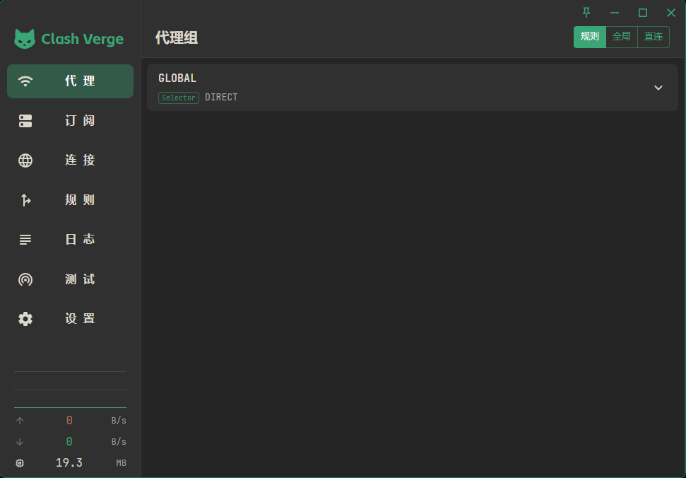
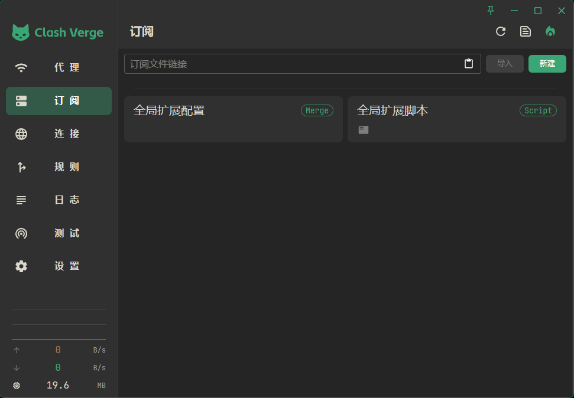
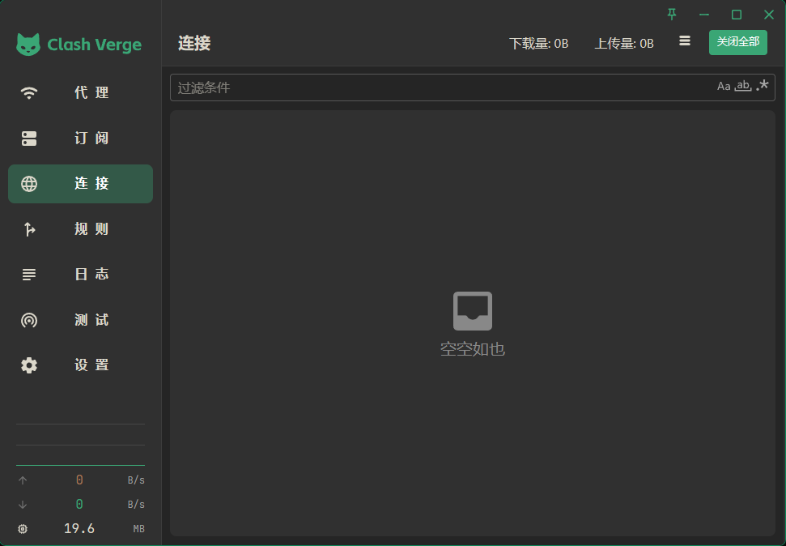
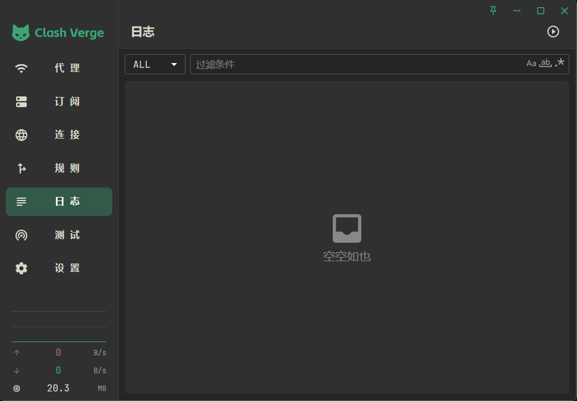
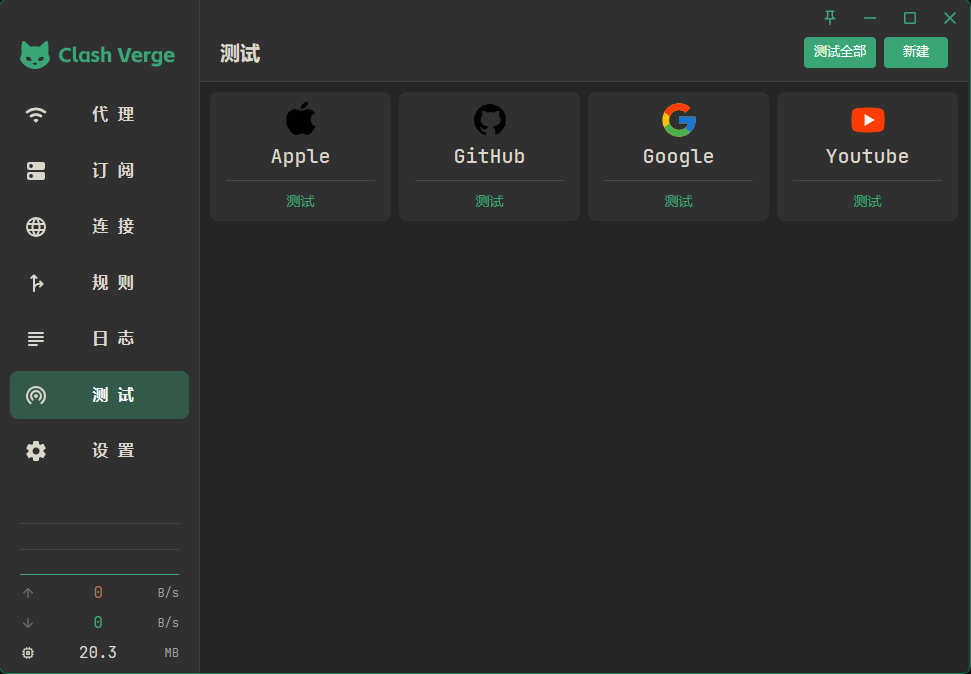
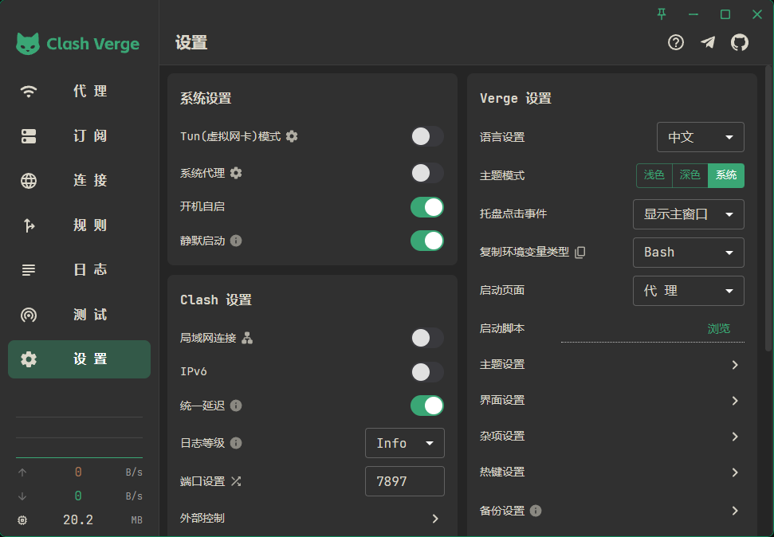

<h1 align="center">
  <a href="https://github.com/clash-verge-rev/clash-verge-rev">Clash Verge Rev</a> Black Theme
  <br>
</h1>

<br>
<div align="center">
    
    
    
    
</div>
<div align="center">
    
    
    
</div>

## 主题设置

| 设置项         | 值                                                                                                                                   |
| -------------- | ------------------------------------------------------------------------------------------------------------------------------------ |
| 主要颜色：     | #3aa675                                                                                   |
| 次要颜色：     | #a67654                                                                                   |
| 文本主要颜色： | <div style="width: 12px;height: 12px;border-radius: 18px;display: inline-block;margin-right: 8px;background: #dbd7ca;"></div>#dbd7ca |
| 文本次要颜色： | <div style="width: 12px;height: 12px;border-radius: 18px;display: inline-block;margin-right: 8px;background: #a6a6a6;"></div>#a6a6a6 |
| 信息颜色：     | <div style="width: 12px;height: 12px;border-radius: 18px;display: inline-block;margin-right: 8px;background: #84c6ff;"></div>#84c6ff |
| 警告颜色：     | <div style="width: 12px;height: 12px;border-radius: 18px;display: inline-block;margin-right: 8px;background: #ffb682;"></div>#ffb682 |
| 错误颜色：     | <div style="width: 12px;height: 12px;border-radius: 18px;display: inline-block;margin-right: 8px;background: #ff9494;"></div>#ff9494 |
| 成功颜色：     | <div style="width: 12px;height: 12px;border-radius: 18px;display: inline-block;margin-right: 8px;background: #59ffb4;"></div>#59ffb4 |
| 字体系列：     | JetBrains Mono                                                                                                                       |

## CSS 注入

```css
/* 主界面 */

.layout__left,
.layout__right {
    background-color: #303030 !important;
}

/* logo */

.the-logo svg,
.the-logo svg path {
    fill: var(--primary-main) !important;
}

/* 代理 */

.css-76jhyu,
.css-5tvqsx,
.css-4h0lmy {
    background-color: #303030 !important;
}

.css-5tvqsx:hover,
.css-4h0lmy:hover {
    background-color: #404040 !important;
}

/* 订阅 */

.css-204wp5,
.css-pv8ete {
    background-color: #303030 !important;
}

/* 连接 */

.css-t4n4qq,
.MuiDataGrid-columnHeader,
.MuiDataGrid-cell {
    background-color: #303030 !important;
}

/* 规则 */

.css-gi9svj {
    background-color: #303030 !important;
}

/* 日志 */

.css-16nv95e {
    background-color: #303030 !important;
}

/* 测试 */

.css-qlwwd {
    background-color: #303030 !important;
}

/* 设置 */

section {
    background-color: #252525 !important;
}

.css-3e4wjh,
.css-1pgrx25 {
    background-color: #303030 !important;
}

/* 弹窗 */
.css-1eotvf7 {
    color: #dbd7ca !important;
    background-color: #303030 !important;
}

.css-1bbnc0p,
.css-i48xom,
.css-101k4ck,
.css-1qwyvza {
    background-color: #303030 !important;
}

/* 右击菜单 */
.css-ly99u5 {
    background-color: #303030 !important;
}
```
