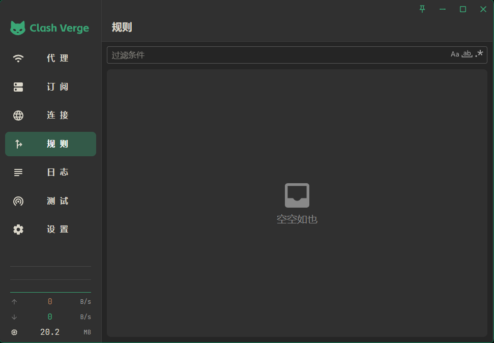

<h1 align="center">
  <a href="https://github.com/clash-verge-rev/clash-verge-rev">Clash Verge Rev</a> Black Theme
  <br>
</h1>

<br>
<div align="center">
    
    
    
    
</div>
<div align="center">
    
    
    
</div>

## 图标

| 设置项             | 值                                                                   |
| ------------------ | -------------------------------------------------------------------- |
| 常规托盘图标：     |        |
| 系统代理托盘图标： |  |
| Tun 模式托盘图标： |           |

## 主题设置

| 设置项         | 值                                                         |
| -------------- | ---------------------------------------------------------- |
| 主要颜色：     |  #3aa675        |
| 次要颜色：     |  #a67654      |
| 文本主要颜色： |  #dbd7ca   |
| 文本次要颜色： |  #a6a6a6 |
| 信息颜色：     |  #84c6ff           |
| 警告颜色：     |  #ffb682        |
| 错误颜色：     |  #ff9494          |
| 成功颜色：     |  #59ffb4        |
| 字体系列：     | [JetBrains Mono](https://www.jetbrains.com/lp/mono/)       |

## CSS 注入

```css
/* 主界面 */

.layout__left,
.layout__right {
    background-color: #303030 !important;
}

/* logo */

.the-logo svg,
.the-logo svg path {
    fill: var(--primary-main) !important;
}

/* 代理 */

.MuiButtonBase-root.MuiListItemButton-root.MuiListItemButton-dense.MuiListItemButton-gutters.MuiListItemButton-root.MuiListItemButton-dense.MuiListItemButton-gutters {
    background-color: #303030 !important;
}

.MuiButtonBase-root.MuiListItemButton-root.MuiListItemButton-dense.MuiListItemButton-gutters.MuiListItemButton-root.MuiListItemButton-dense.MuiListItemButton-gutters:hover {
    background-color: #404040 !important;
}

/* 订阅 */

.MuiGrid2-root.MuiGrid2-direction-xs-row.MuiGrid2-grid-xs-12.MuiGrid2-grid-sm-6.MuiGrid2-grid-md-4.MuiGrid2-grid-lg-3 > .MuiBox-root > .MuiBox-root,
.MuiGrid2-root.MuiGrid2-direction-xs-row.MuiGrid2-grid-xs-12.MuiGrid2-grid-sm-6.MuiGrid2-grid-md-6.MuiGrid2-grid-lg-6 > .MuiBox-root {
    background-color: #303030 !important;
}

.base-content > .MuiBox-root:nth-child(2):has(> .MuiBox-root) {
    background-color: #252525 !important;
}

/* 连接 */
.MuiDataGrid-virtualScroller.MuiDataGrid-virtualScroller--hasScrollX,
.MuiDataGrid-columnHeader,
.MuiDataGrid-cell {
    background-color: #303030 !important;
}

/* 规则 */

.base-content > .MuiBox-root:nth-child(2) {
    background-color: #303030 !important;
}

/* 日志 */

/* 测试 */

.MuiGrid2-root.MuiGrid2-direction-xs-row.MuiGrid2-grid-xs-6.MuiGrid2-grid-lg-2.MuiGrid2-grid-sm-4.MuiGrid2-grid-md-3 > .MuiBox-root > .MuiBox-root {
    background-color: #303030 !important;
}

/* 设置 */

section {
    background-color: #252525 !important;
}

.MuiPaper-root.MuiPaper-elevation.MuiPaper-rounded.MuiPaper-elevation2,
.MuiPaper-root.MuiPaper-elevation.MuiPaper-rounded.MuiPaper-elevation1.MuiTableContainer-root,
.MuiGrid-root.MuiGrid-item.MuiGrid-grid-xs-12.MuiGrid-grid-md-6 > .MuiBox-root {
    background-color: #303030 !important;
}

/* 弹窗 */

.MuiPaper-root.MuiPaper-elevation.MuiPaper-elevation6.MuiSnackbarContent-root {
    color: #dbd7ca !important;
    background-color: #303030 !important;
}

.MuiPaper-root.MuiPaper-elevation.MuiPaper-rounded.MuiPaper-elevation24.MuiDialog-paper.MuiDialog-paperScrollPaper.MuiDialog-paperWidthXl.MuiDialog-paperFullWidth,
.MuiPaper-root.MuiPaper-elevation.MuiPaper-rounded.MuiPaper-elevation24.MuiDialog-paper.MuiDialog-paperScrollPaper.MuiDialog-paperWidthSm {
    background-color: #303030 !important;
}

/* 右击菜单 */
.MuiPaper-root.MuiPaper-elevation.MuiPaper-rounded.MuiPaper-elevation8.MuiPopover-paper.MuiMenu-paper.MuiMenu-paper {
    background-color: #303030 !important;
}
```
